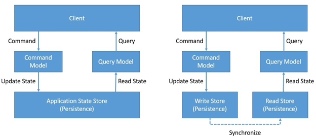
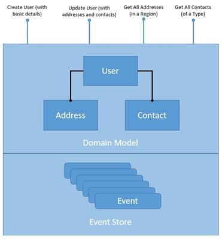

# Backend Toolbox
## whatever a backend developer needs to know

###  What is CQRS
CQRS is about segregating the command and query side of the application architecture. CQRS is based on the Command Query Separation (CQS) principle which was suggested by Bertrand Meyer. 
CQS suggests! that we divide the operations on domain objects into two distinct categories: Queries and Commands:

Queries return a result and do not change the observable state of a system. Commands change the state of the system but do not necessarily return a value.  

[CQRS and Event Sourcing in Java](https://https://www.baeldung.com/cqrs-event-sourcing-java) 

### Event Sourcing
 
Here, we've structured our repository to store an ordered list of domain events. Every change to the domain object is considered an event. How coarse or fine-grained an event should be is a matter of domain design. The important things to consider here are that events have a temporal order and are immutable.

Link: 
[CQRS and Event Sourcing in Java](https://www.baeldung.com/cqrs-event-sourcing-java#introducing_event_sourcing) 

